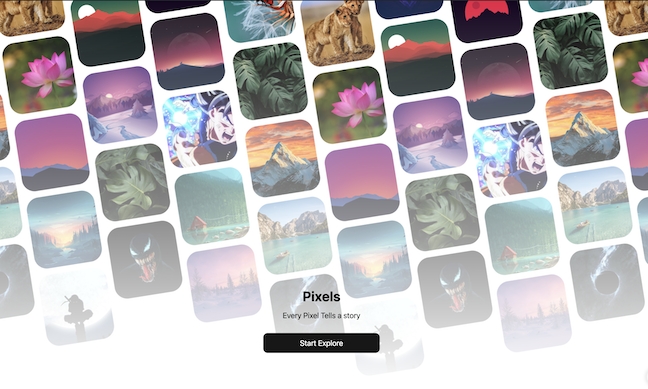

# Wallpapers App

A beautiful and modern React Native application for browsing, filtering, and downloading high-quality wallpapers. Built with Expo, Reanimated, and Nativewind, this app provides a smooth and customizable user experience.

## Features

- **Image Grid:** Responsive masonry grid for displaying wallpapers.
- **Categories:** Browse wallpapers by a variety of categories (nature, fashion, technology, and more).
- **Filters:** Filter wallpapers by orientation, type, and color.
- **Download Support:** (Planned) Download images directly to your device.
- **Smooth Animations:** Powered by Reanimated for seamless UI transitions.
- **Modern Styling:** Styled with Nativewind (Tailwind CSS for React Native).

## Tech Stack

- Expo
- React Native
- Reanimated
- Nativewind
- TypeScript

## Folder Structure

- `src/components/` – UI components (image grid, cards, filters, categories)
- `src/constants/` – Categories and filter options
- `src/core/` – App configuration and static assets
- `src/data/` – Image fetching logic (Pixabay API)
- `src/helpers/` – Utility functions for layout and sizing
- `src/assets/` – Fonts and images

## How It Works

The app fetches wallpapers from the Pixabay API and displays them in a responsive grid. Users can filter wallpapers by category, orientation, type, and color. The UI is optimized for both performance and aesthetics, with smooth animations and modern styling.

## Installation & Running

1. **Clone the repository:**
   ```sh
   git clone <your-repo-url>
   cd react-native-wallpaper-app
   ```

2. **Install dependencies:**
   ```sh
   npm install
   ```

3. **Start the Expo development server:**
   ```sh
   npm run start
   ```

4. **Run on your device:**
   - Use the Expo Go app on your phone to scan the QR code.
   - Or, run on an emulator using the Expo CLI prompts.

## Configuration

- The app uses the Pixabay API. You can set your own API key in `src/core/config/index.tsx` or use the default public key.

## Screenshots


---

Made with ❤️ using React Native, Expo, and the open Pixabay API.
